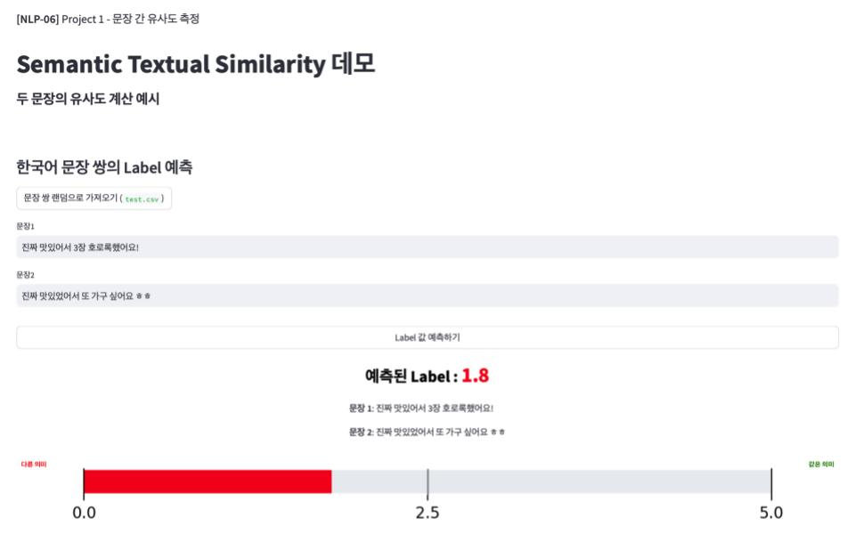
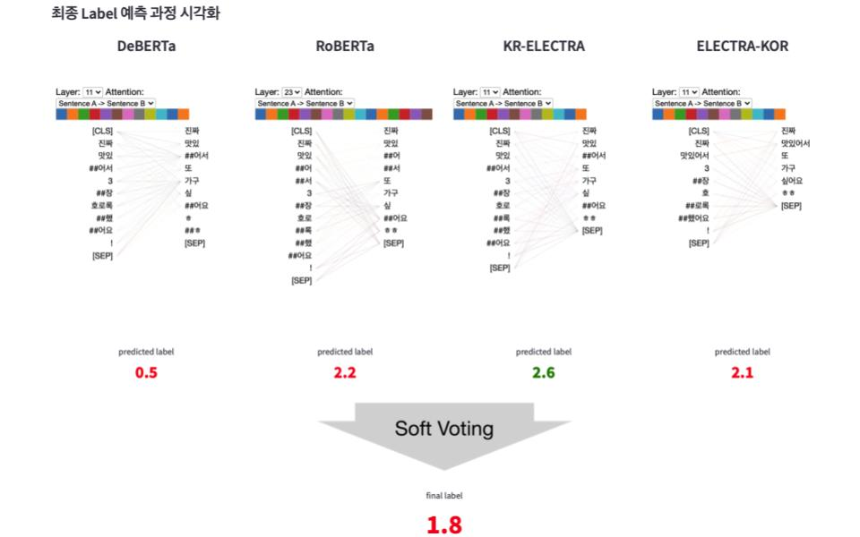
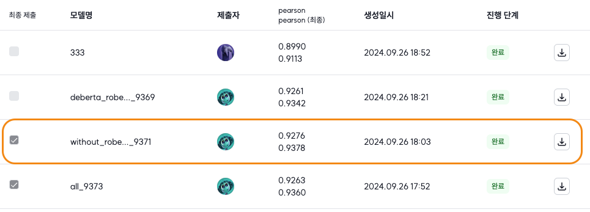

# [네이버 부스트캠프] 문장 간 유사도 측정 프로젝트
> 2024 네이버 부스트캠프 AI Tech 7기 NLP track 과정에서 수행된 **문장 간 유사도 측정** 프로젝트입니다.

## 1. 프로젝트 개요
- **과제**: 두 한국어 문장의 의미 유사도 판별 (Semantic Text Similarity; STS)
- **목표**:
    - 자연어 처리 모델링의 전체 과정 학습 및 핵심 기술 습득
    - 협업 도구(GitHub, Jira 등)를 활용한 원활한 소통과 의사결정 경험
- **기간**: 2024.09.11 ~ 2024.09.26 (3주)
- **인원**: 6명 ([@서태영](https://github.com/sty0507), [@오수현](https://github.com/ocean010315), [@이상의](https://github.com/LeSaUi), [@이정인](https://github.com/leeennn), [@이정휘](https://github.com/LeeJeongHwi), [@정민지](https://github.com/minjijeong98))
- **성과**: 결과 지표인 피어슨 계수 0.9378 달성 (베이스라인 대비 0.1760 향상)

## 2. 데이터 
- **탐색적 데이터 분석**: `eda/eda.ipynb`에서 데이터 주요 특성 파악
- **전처리**: `eda/preprocessing.py`에서 불필요한 데이터 처리 및 교정
- **데이터 증강**:  `data_augmentation` 폴더에서 다양한 증강 전략 시도
    - **증강 전략**
        - `0.0` **레이블 삭제**: 데이터 불균형 해소를 위한 삭제 전략
        - **Swap Sentence**: 문장 순서 교체 방식의 증강
        - **생성형 방식**: Back Translation(BT), BERT, GPT-4o 기반 증강 시도
    - **관련 코드**:
        - `data_augmentation_back_translation.ipynb`: Back Translation
        - `data_augmentation_BERT_SWAP.ipynb`: BERT + Swap Sentence
        - `data_augmentation_BERT_SWAP_BT.ipynb`: Bert + Swap Sentence + Back Translation
        - `data_augmentation_llm.ipynb`, `data_augmentation_llm_conservative.ipynb`: GPT-4o 기반 증강

## 3. 모델
- **모델링 방법**: 두 가지 접근 방식을 시도
    1. **PyTorch 기반**: 기본적인 모델 구현 및 성능 개선 (링크: ##TODO: 링크 추가)
    2. **HuggingFace Trainer 기반**: 훈련 프로세스의 간소화 및 자동화 (설명 링크: )

## 4. 결과

### 데모 페이지 (Streamlit)

- **데모 기능**: Streamlit을 활용하여 문장 유사도 예측 성능을 직관적으로 시각화하는 프로토타입을 제작했습니다. 최종 예측 레이블은 개별 모델의 예측을 soft-voting 방식으로 결합해 도출되었습니다.

_Streamlit을 이용한 두 문장 간 유사도 예측 결과 시각화_

_앙상블 모델의 예측 레이블 및 과정 시각화_

- **주요 확인 사항**: 
    1.  **정확한 유사도 예측**: 유사한 문장은 높은 유사도를, 다른 의미의 문장은 낮은 유사도를 예측함.
    2.  **앙상블 효과**: 일부 모델이 부정확한 예측을 하더라도 앙상블을 통해 최종 결과는 보다 안정적임을 확인.

### 리더보드 성과
- **최종 성과**: 피어슨 상관계수 `0.9378`, 최종 리더보드 `10위/16팀` 달성

- **개선 성과**: 베이스라인(`0.7618`) 대비 성능 `0.1760` 향상.
- **일반화 성능**: public 리더보드에서 더 높은 성능을 기록해 견고한 모델임을 입증.

